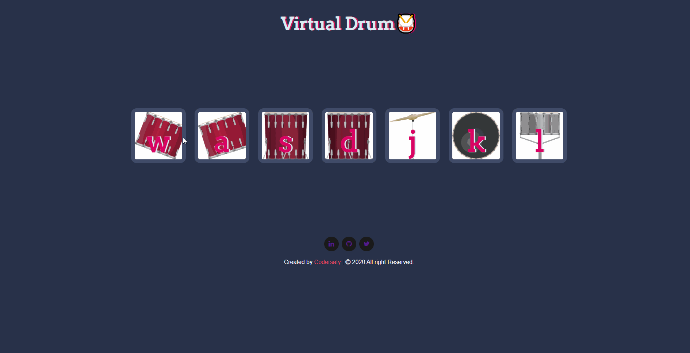

<h1 align="center" id="top">Welcome to Virtual Drum👋</h1>

# Basic Overview

> This project is a simple responsive website to replicate a musical instrument [drum](https://en.wikipedia.org/wiki/Drum) developed to practice javascript.

 

[Live Demo](https://codersaty.github.io/drum-kit/)

 

# Table of Contents

- [Technologies Used](#technologies)
- [Features](#features)
- [References](#references)
- [License](#license)
- [ToDos](#To-Dos)
- [Related Projects](#related-projects)
- [Support](#support)
- [Author Info](#author-info)

 

# Technologies

- [HTML5](https://en.wikipedia.org/wiki/HTML5)
- [CSS3](https://en.wikipedia.org/wiki/CSS)
- [JavaScript](https://en.wikipedia.org/wiki/JavaScript)
- [Git](https://en.wikipedia.org/wiki/Git)
- [Markdown](https://en.wikipedia.org/wiki/Markdown)

### Tools used

- [VS Code](https://en.wikipedia.org/wiki/Visual_Studio_Code)
- [Github](https://en.wikipedia.org/wiki/GitHub)

 

# Feature

- You can play the drum using the mouse as well as keyboard.

# References

I have used the following resources in creation of this project:

- [The Complete 2021 Web Development Bootcamp](https://www.udemy.com/course/the-complete-web-development-bootcamp/)

 

# License

[MIT License](LICENSE.md)

Copyright (c) 2021 @[codersaty](http://codersaty.me)

 

# To Dos

> Thinking About it.

 

# Related Projects

> I will add the projects soon.

 

# Support

In case of any problem/ query, feel free to do pull requests or contact the author.

 

# Author Info

- Twitter - [@codersaty](https://twitter.com/codersaty)
- Website - [Anuranjan Srivastava](http://codersaty.me)
- Linkedin - [codersaty](https://www.linkedin.com/in/codersaty)

 

[Back To The Top](#top)